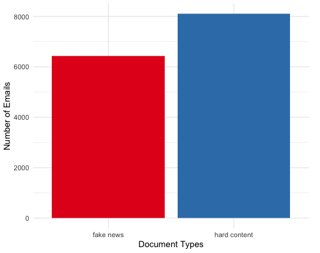
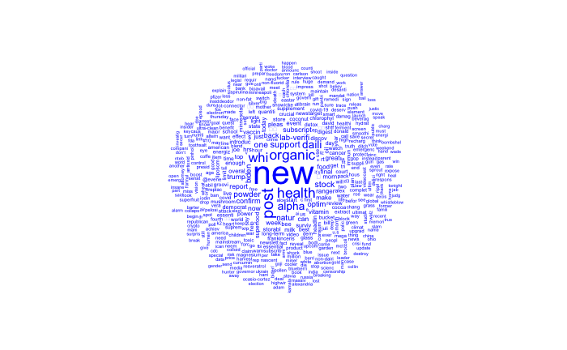
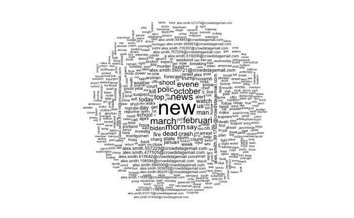
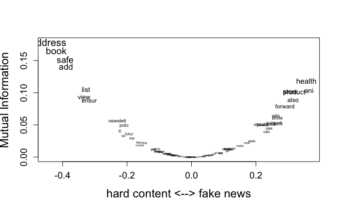

# Fake News vs. Hard Content: A Text-as-Data Project

**Text Classification on Newsletters Involving Fake News and Hard Content**

## Project Overview

This project investigates whether fake news strategically leans into soft sensational topics, which is contrary to the common assumption that it is mostly political. Using quantitative text analysis in R, I compared fake news and factual news content to identify word patterns, topic clusters, and framing differences.

### Research Questions

1. What are the most distinctive and overlapping words across fake and hard news?
2. What major topics (clusters) appear in each document type?
3. Does fake news mostly feature hard content, as often assumed?

## Data

The dataset includes **14,543 political newsletter emails** collected by a political science lab at UC San Diego. Domains are split into:

- **Fake News**: 6,432 emails from 106 misinformation domains
- **Hard Content**: 8,111 emails from 75 reliable news domains (Bakshy et al., 2015)

No domain appears in both groups. Documents were processed into Document-Feature Matrices (DFMs).

| Category      | Emails | DFM Features |
|---------------|--------|--------------|
| Fake News     | 6,432  | 5,781        |
| Hard Content  | 8,111  | 8,375        |

This clean division supports a valid comparison. However, findings are based on email newsletters and may not generalize to full articles or social media posts.

Analysis Scripts:
- [POLI274_Final_Project.Rmd](./POLI274_Final_Project.Rmd)

## Methods & Key Findings

Written Report:
- [POLI274_Final_Project_Allan_Lam.pdf](./POLI274_Final_Project_Allan_Lam.pdf)

### 1. Discriminatory Word Analysis

Documents were trimmed to terms appearing in ≥20% of texts. This reduced noise and surfaced common language patterns.

**Findings:**
- **Fake news** used words like _“health,” “product,” “store”_, suggesting a focus on soft or sensational themes.
- **Hard content** featured terms like _“address,” “book,” “safe”_, indicating newsletter formatting or administrative tone.
- Some overlap (e.g., _“state,” “world”_) points to blurred boundaries between types.

  
   
  <em>Figure 1: Number of emails by document types</em>

  
   
  <em>Figure 2: Word cloud representation for the fake news corpus</em>

  
   
  <em>Figure 3: Word cloud representation for the hard content corpus</em>

### 2. Topic Clustering

K-means clustering on STM-prepped documents uncovered latent content themes. After tuning, I finalized:

- **9 clusters** for fake news
- **4 clusters** for hard content

**Findings:**
- **Fake news** covered more diverse topics: health, politics (e.g., _“Trump,” “Biden”_), and ambiguous/structural language.
- **Hard content** focused on narrow themes like international or regional news and law enforcement.
- This supports the idea that fake news varies in topics to capture attention, aiding its spread.

  
   
  <em>Figure 4: Discriminatory words across document types</em>

### 3. Manual Coding & Supervised Classification

I hand-coded 200 fake news documents for “hard content” framing. Then, I trained two classifiers:

- **Naïve Bayes** (F-score: 0.69) outperformed **Lasso** (F-score: 0.52).
- Applied to the full datasets:
  - **43.89%** of fake news predicted as hard content
  - **63.58%** of hard content predicted as hard content

| Validation  | Lasso  | Naïve Bayes  |
|-------------|--------|--------------|
| Accuracy    | 0.74   | 0.78         |
| Precision   | 0.78   | 0.71         |
| Recall      | 0.39   | 0.67         |
| F-score     | 0.52   | 0.69         |

**Implications:**
- Fake news occasionally features hard content but leans toward softer topics.
- This challenges the assumption that fake news is mostly political, suggesting instead that it aims for broad appeal and shareability.

**Limitations:**
- Training data came only from fake news samples, which may bias results.
- A balanced training set or use of LLMs could improve generalization, but was outside the scope.
